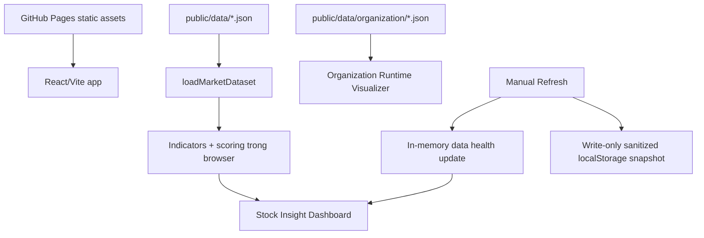

# Kiến trúc

VN Stock Insight là ứng dụng React + TypeScript build bằng Vite và triển khai tĩnh trên GitHub Pages. MVP không có backend runtime, không nhúng API key trong frontend, và không tuyên bố có dữ liệu thị trường live.

Nguồn dữ liệu hiện tại là các JSON fixture đã validate trong `public/data`. Các adapter ETL trong tương lai có thể thay thế cách tạo fixture, nhưng cần giữ nguyên hợp đồng JSON để UI, scoring và kiểm thử tiếp tục hoạt động ổn định.

## Thành phần chính

| Thành phần | Vai trò |
|---|---|
| `src/App.tsx` | Điều phối tải dữ liệu, lỗi tải dữ liệu, manual refresh và hai workspace UI. |
| `src/data/loaders.ts` | Đọc JSON tĩnh qua `fetch` dựa trên `import.meta.env.BASE_URL`. |
| `src/data/manualRefresh.ts` | Manual refresh best-effort trong browser, chỉ lưu snapshot sanitize vào `localStorage`. |
| `src/domain/*` | Tính chỉ báo kỹ thuật, scoring, recommendation và tổng hợp telemetry tổ chức. |
| `src/components/*` | Dashboard cổ phiếu, chi tiết cổ phiếu, shell và Organization Runtime Visualizer. |
| `public/data` | Nguồn dữ liệu tĩnh được validate cho stock, fundamentals, prices, data health và trace tổ chức. |
| `.github/workflows` | CI, Daily ETL và GitHub Pages deployment. |

## Luồng runtime

Ứng dụng build với base path `/` khi chạy local. Khi workflow Pages set `GITHUB_PAGES=true`, `vite.config.ts` dùng base `/vn-stock-insight/` để asset và JSON path đúng trên GitHub Pages.

## Ranh giới MVP

- Dữ liệu chính thức của MVP là static JSON đã validate, không phải feed giá live.
- Manual refresh hiện tại không gọi endpoint thị trường live; nó cập nhật nhãn nguồn dữ liệu và snapshot cục bộ để kiểm thử fallback UX.
- Mọi thay đổi liên quan data contract, scoring, CI/CD hoặc hosting cần review theo vai trò trong tài liệu release và AI organization.
