# VN Stock Insight Design Spec

Date: 2026-06-07

Repository target: `anhtnt90dev/vn-stock-insight`

Deployment target: GitHub Pages from `main`

## 1. Purpose

`VN Stock Insight` is a Vietnamese web app for analyzing and tracking potential Vietnamese stocks. The MVP focuses on VN30 plus a configurable watchlist. It combines fundamental analysis and technical analysis, generates a transparent score, and presents investment-support recommendations for a medium-term horizon of 1-6 months.

The app is a decision-support tool. It does not provide personalized financial advice, does not guarantee returns, and must always show the reasoning, risk factors, data quality, and confidence behind each recommendation.

## 2. Customer Requirements

- Build a public GitHub repository under `anhtnt90dev`.
- Use branches `feature/*`, `dev`, and `main`.
- Deploy GitHub Pages only from `main`.
- Run a complete CI/CD workflow with professional quality gates.
- Require role-based review before merge, including Tech Lead, Architect when applicable, and related domain reviewers.
- Simulate an AI software company where each position can become an agent or sub-agent.
- Include Sales/Presales and proposal/estimate flow before delivery.
- Build a Vietnamese dashboard UI, not a marketing landing page.
- Track VN30 plus a default watchlist.
- Allow users to add/remove personal watchlist symbols locally in the browser.
- Use public/free market data where technically and legally feasible.
- Update official static data daily after market close using GitHub Actions.
- Add a manual browser Refresh button that tries to call public APIs directly, then falls back to static data if the live call fails.
- Combine fundamental and technical analysis with a 50/50 score.
- Show both soft rating labels and action labels:
  - Soft labels: `Rất tiềm năng`, `Theo dõi`, `Trung lập`, `Rủi ro cao`
  - Actions: `Buy`, `Hold`, `Sell/Avoid`
- Generate rule-based explanation without requiring an AI API key.

## 3. AI Organization Model

The AI team is modeled like a software company. Roles are stable responsibilities. Sub-agents are spawned only when the work is well-scoped and can run independently or in parallel.

The orchestrator acts as Engineering Manager and Delivery Lead:

- Clarifies the current customer goal.
- Splits work into role-owned tasks.
- Spawns sub-agents for bounded tasks when useful.
- Reviews outputs from sub-agents.
- Integrates code and documentation.
- Runs verification.
- Reports progress and release status to the customer.

### 3.1 Roles

| Role | Responsibility | Typical Output |
|---|---|---|
| Sales Agent | Receive customer request, prepare proposal, communicate scope and estimate | Proposal, assumptions, estimate |
| Presales Agent | Shape solution direction before delivery | High-level solution, risks, options |
| BA/PO Agent | Convert customer intent into requirements and acceptance criteria | Requirements, backlog, acceptance criteria |
| Architect Agent | Own architecture, major technical decisions, data flow, security posture | Architecture decision, diagrams, review approval |
| Tech Lead Agent | Own implementation quality and integration | Code review, implementation guidance |
| Data Engineer Agent | Build ETL, normalization, schema validation | Data pipeline, data contracts |
| Quant Analyst Agent | Design scoring model and recommendation rules | Scoring engine, thresholds, rationale |
| Frontend Engineer Agent | Build dashboard and user workflows | UI components, charts, interactions |
| QA Engineer Agent | Define and run test strategy | Test plan, regression evidence |
| DevOps Engineer Agent | Own CI/CD, GitHub Pages, branch protection, release flow | Workflows, deployment, release checklist |

### 3.2 Organization Workflow

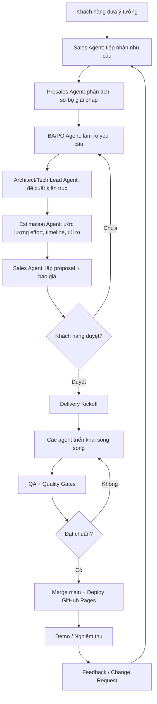

### 3.3 Agent Collaboration Workflow

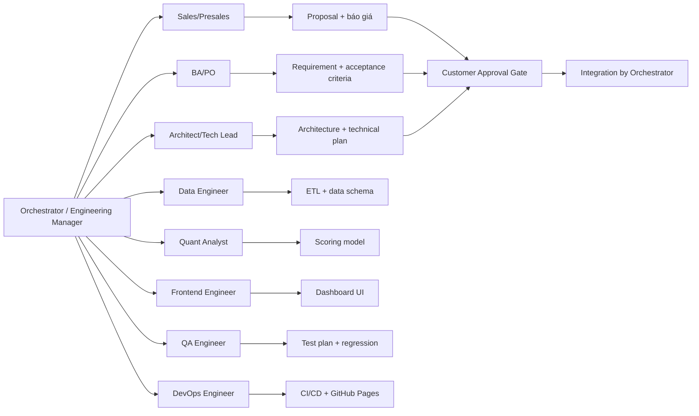

## 4. Product Scope

### 4.1 MVP In Scope

- Static web app deployed on GitHub Pages.
- Vietnamese dashboard interface.
- VN30 tracking.
- Default repo-managed watchlist.
- Browser-local custom watchlist using local storage.
- Daily ETL workflow after market close.
- Static JSON data generated by CI.
- Best-effort manual browser Refresh against public APIs.
- Fundamental and technical score, weighted 50/50.
- Rule-based recommendation explanation.
- Data health and provenance display.
- CI/CD quality gates and role-based review gates.
- Documentation for development, data pipeline, scoring, and release.

### 4.2 Out of Scope for MVP

- Real-time intraday trading terminal.
- Personalized portfolio advice.
- Brokerage integration.
- User login/accounts.
- Paid API integration unless explicitly approved later.
- Backend service or secret-bearing API proxy.
- AI-generated natural language explanation using OpenAI/Azure OpenAI API.
- Automated order execution.

## 5. Architecture

The recommended architecture is static-first with scheduled ETL. GitHub Actions prepares data and the GitHub Pages app consumes static assets.

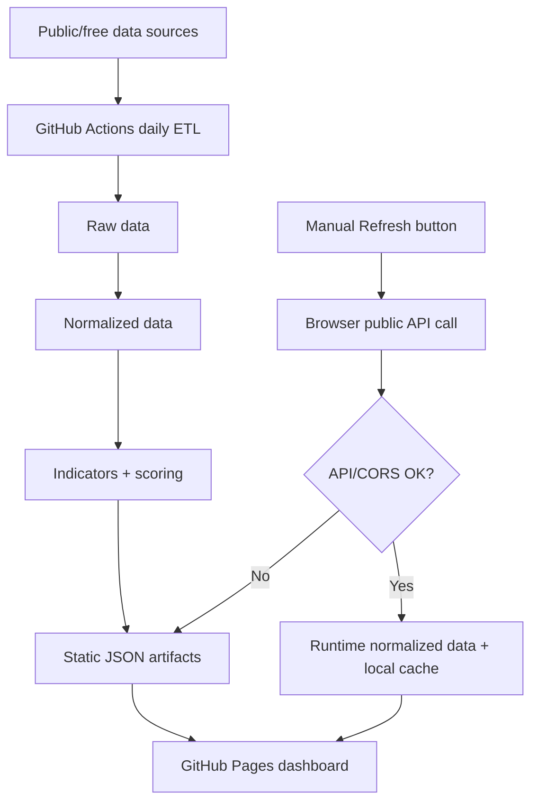

### 5.1 Data Source Strategy

The official production baseline is static JSON generated by GitHub Actions. Public/free data endpoints can be unstable, rate-limited, blocked by CORS, or change without notice. Therefore:

- CI-generated data is the authoritative app data for production display.
- Browser Refresh is best-effort only.
- If public APIs fail, the dashboard must remain usable with the latest static data.
- No API key or secret may be embedded in frontend code.
- Data provenance and update timestamp must be displayed.

## 6. Data Model

The ETL should produce versioned, schema-validated JSON files.

| File | Purpose |
|---|---|
| `data/stocks.json` | VN30 and default watchlist metadata |
| `data/prices/{symbol}.json` | Daily OHLCV history |
| `data/fundamentals/{symbol}.json` | Available fundamental metrics |
| `data/indicators/{symbol}.json` | Technical indicators and derived trends |
| `data/recommendations.json` | Final scores, labels, actions, explanations |
| `data/data-health.json` | Source, timestamp, missing data, ETL status |

### 6.1 ETL Flow

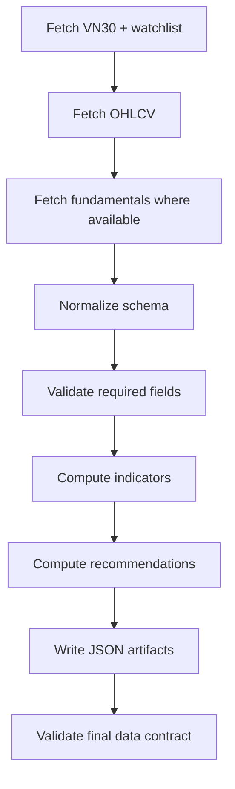

## 7. Scoring Engine

The score is a 0-100 value made of 50% fundamental score and 50% technical score.

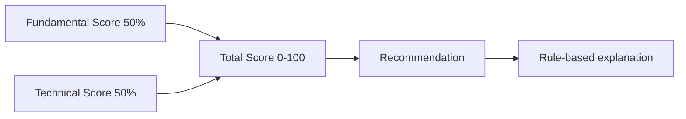

### 7.1 Fundamental Score

Inputs are used when available. Missing or stale data lowers confidence.

- Valuation: P/E, P/B, relative reasonableness when enough context exists.
- Business quality: ROE, margin, EPS.
- Growth: revenue, profit, EPS trend.
- Financial risk: debt/equity, profit volatility, missing data.

### 7.2 Technical Score

- Trend: price versus SMA20, SMA50, SMA200.
- Momentum: RSI and MACD.
- Volume confirmation: current volume versus 20-session average.
- Risk: volatility, recent drawdown, trend breakdown.

### 7.3 Recommendation Mapping

| Total Score | Soft Label | Default Action |
|---:|---|---|
| 80-100 | `Rất tiềm năng` | `Buy` |
| 65-79 | `Theo dõi` | `Buy` or `Hold` depending on risk and signal conflict |
| 50-64 | `Trung lập` | `Hold` |
| 0-49 | `Rủi ro cao` | `Sell/Avoid` |

The action may be softened when data confidence is low. For example, a high technical score with missing fundamentals should avoid a strong `Buy` unless the confidence rule allows it.

### 7.4 Explanation Rules

Each recommendation must include:

- Main reason for score.
- Positive fundamental signals.
- Negative fundamental signals.
- Positive technical signals.
- Negative technical signals.
- Key risks.
- Data confidence.
- Missing or stale data notes.

## 8. UI Design

The UI should be a professional Vietnamese analysis dashboard. It should prioritize dense but organized information over marketing presentation.

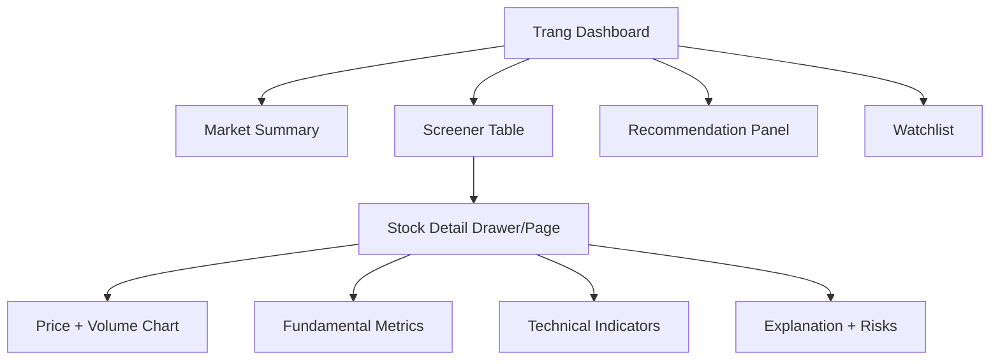

### 8.1 Dashboard

- Compact header with app name, data timestamp, data health, and Refresh button.
- Market summary with number of `Buy`, `Hold`, `Sell/Avoid` stocks.
- Screener table with:
  - Symbol
  - Total score
  - Fundamental score
  - Technical score
  - Soft label
  - Action
  - P/E, P/B, ROE
  - RSI, trend, volume signal
  - Data confidence
- Filters:
  - Action
  - Score range
  - Risk group
  - Watchlist
  - Symbol search

### 8.2 Stock Detail

- Price and volume chart.
- Technical panel: RSI, MACD, SMA20, SMA50, SMA200, trend status.
- Fundamental panel: P/E, P/B, ROE, EPS growth, debt/equity when available.
- Recommendation explanation:
  - Reason
  - Positive signals
  - Negative signals
  - Risks
  - Data confidence
- Add/remove local watchlist action.

### 8.3 User Workflow

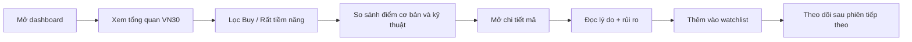

## 9. Manual Browser Refresh

Manual Refresh gives users a way to try direct browser-side updates without waiting for the daily ETL. It is not the production source of truth.

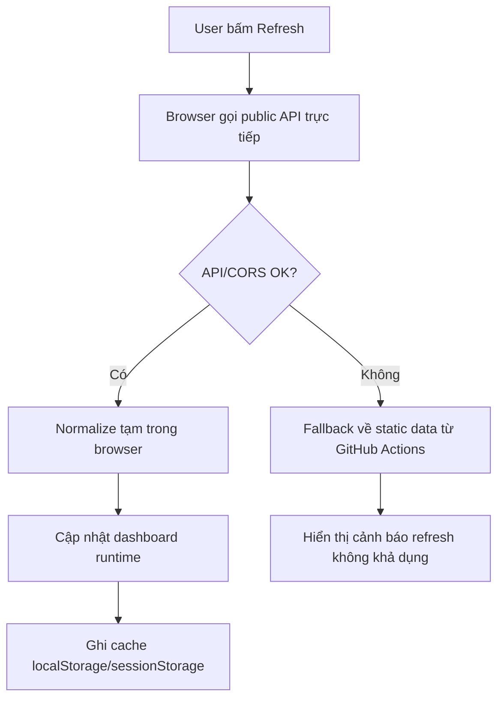

Requirements:

- Refresh button must show loading, success, and error states.
- Refresh must never break the dashboard if the live API fails.
- Refreshed data must be clearly labeled as manual runtime data.
- Manual data may be cached locally but must not be committed to the repo.
- Static ETL data remains the default on first load.

## 10. Git Branching and CI/CD

### 10.1 Branch Model

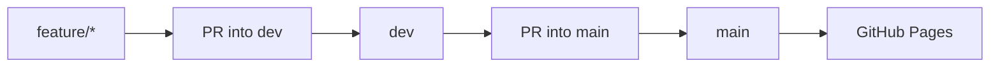

Rules:

- Work starts on `feature/*` branches.
- `dev` is the integration branch.
- `main` is production.
- GitHub Pages deploys from `main`.
- Direct pushes to `dev` and `main` should be blocked when branch protection is available.

### 10.2 Pull Request CI

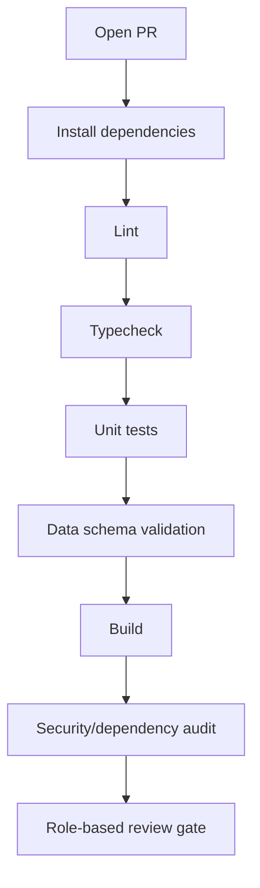

Quality gates:

- Lint must pass.
- Typecheck must pass if TypeScript is used.
- Unit tests must cover scoring and data normalization.
- Static data schema validation must pass.
- Production build must pass.
- Dependency/security audit must run at an appropriate MVP level.
- PR description must include scope, acceptance criteria, testing evidence, and risks.

### 10.3 Role-Based Review Gate

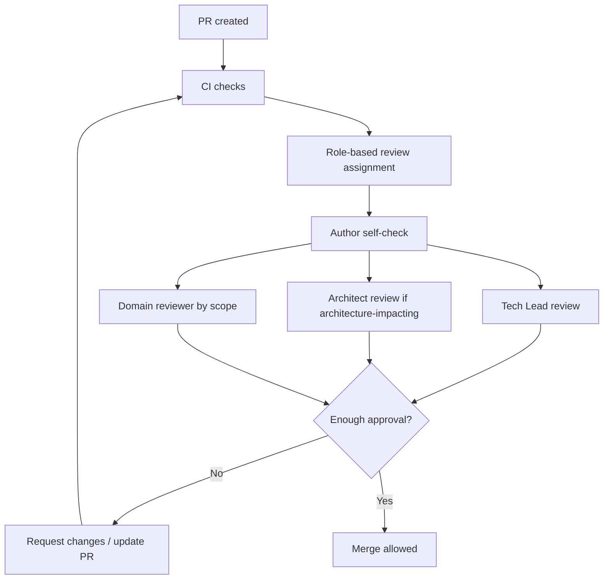

Every PR into `dev` requires:

- CI pass.
- Author self-check.
- Tech Lead approval.
- Domain reviewer approval based on file scope:
  - Data/ETL: Data Engineer.
  - Scoring/recommendation: Quant Analyst.
  - UI/UX: Frontend/UI reviewer.
  - Tests: QA Engineer.
  - Workflow/deploy: DevOps Engineer.

Architect approval is required when a PR changes:

- App architecture.
- Data flow or data contracts.
- Repository structure.
- CI/CD, branch policy, or deploy strategy.
- Scoring model structure.
- Major dependency or external service strategy.
- Any change that moves the app away from static GitHub Pages.

PR from `dev` into `main` requires:

- Production CI pass.
- Tech Lead approval.
- Architect approval.
- QA sign-off.
- DevOps sign-off.
- Release notes.
- Post-deploy smoke checklist.

For a personal GitHub account without separate GitHub users for each AI agent, approvals can be recorded through PR checklist items and orchestrator comments. If separate bot identities are available later, CODEOWNERS and required reviewers can map to those identities.

### 10.4 Deployment

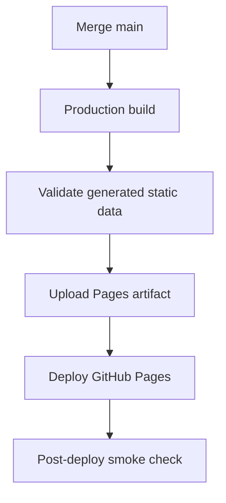

### 10.5 Daily ETL Workflow

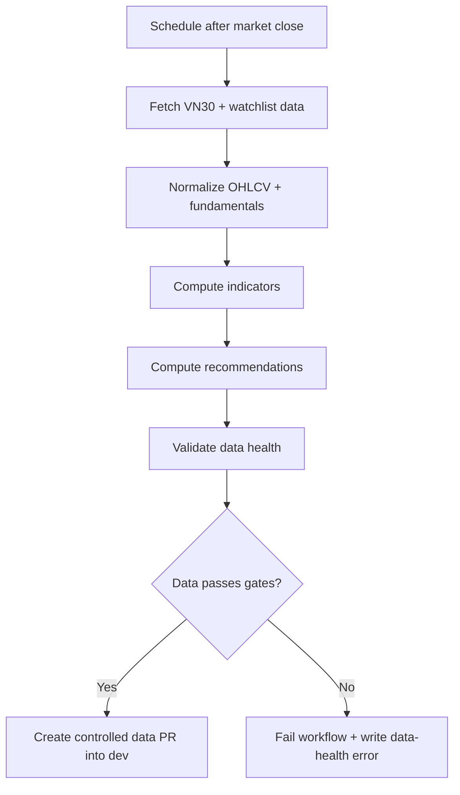

The MVP should prefer data PRs into `dev` rather than auto-pushing directly to production. This preserves review and quality governance.

## 11. Repository Governance Files

The repo should include:

- `.github/workflows/ci.yml`
- `.github/workflows/pages.yml`
- `.github/workflows/daily-etl.yml`
- `.github/pull_request_template.md`
- `.github/ISSUE_TEMPLATE/feature_request.md`
- `.github/ISSUE_TEMPLATE/bug_report.md`
- `.github/CODEOWNERS`
- `docs/architecture.md`
- `docs/data-pipeline.md`
- `docs/scoring.md`
- `docs/release-process.md`
- `docs/ai-organization.md`

## 12. Milestones

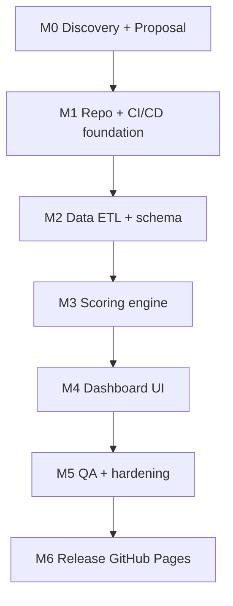

| Milestone | Outcome |
|---|---|
| M0 Discovery + Proposal | Approved scope, estimate, architecture direction |
| M1 Repo + CI/CD foundation | Branch model, workflows, templates, Pages foundation |
| M2 Data ETL + schema | VN30/watchlist data artifacts and validation |
| M3 Scoring engine | Fundamental/technical scoring and recommendations |
| M4 Dashboard UI | Usable Vietnamese screener and stock detail dashboard |
| M5 QA + hardening | Tests, regression, data error handling, smoke checks |
| M6 Release | Production GitHub Pages deployment from `main` |

## 13. Proposal and Estimate

The estimate is expressed as simulated AI effort days. It is used to model a professional software proposal process, not as a real invoice.

| Work Item | Effort |
|---|---:|
| Discovery, requirement, proposal | 1 day |
| Architecture, repo setup, branch governance | 1 day |
| CI/CD, GitHub Actions, Pages pipeline | 1.5 days |
| Data ETL public/free + schema validation | 2 days |
| Scoring engine fundamental/technical | 2 days |
| Dashboard UI + stock detail | 3 days |
| Watchlist + local storage | 0.5 day |
| Manual browser Refresh + fallback | 1 day |
| QA, unit test, regression, smoke test | 1.5 days |
| Release, documentation, handover | 1 day |

Total simulated estimate: 15.5 AI effort days.

## 14. Risks and Assumptions

Risks:

- Public/free market data endpoints can change, throttle, or block browser calls.
- Some fundamental metrics may be missing or stale.
- Browser Refresh may fail because of CORS or endpoint changes.
- Static GitHub Pages cannot safely store API secrets.
- A personal GitHub account may not support fully automated reviewer identities for each simulated AI role.

Assumptions:

- MVP prioritizes daily post-market analysis rather than intraday trading.
- Public/free data is acceptable for MVP exploration.
- Rule-based explanations are acceptable for MVP.
- The customer accepts that strong recommendations are softened when data confidence is low.
- GitHub Pages is the production hosting target.

Mitigations:

- Keep static ETL output as the production source of truth.
- Show data health and confidence.
- Use schema validation to prevent malformed data from deploying.
- Keep browser Refresh optional and fault-tolerant.
- Record AI role approvals in PR comments/checklists when separate reviewer identities are unavailable.

## 15. Acceptance Criteria

- Public repo target is `anhtnt90dev/vn-stock-insight`.
- Branches `feature/*`, `dev`, and `main` are used.
- GitHub Pages deploys from `main`.
- Dashboard displays VN30 plus default watchlist.
- User can add/remove local watchlist symbols in the browser.
- Daily ETL workflow generates valid static JSON data.
- Manual Refresh button attempts browser API update and falls back safely.
- Each stock has total score, fundamental score, technical score, soft label, action, explanation, risks, and confidence.
- Recommendation logic follows 50/50 fundamental/technical weighting.
- CI gates run before merge.
- PRs require Tech Lead and relevant domain review.
- Architecture-impacting PRs require Architect review.
- `dev` to `main` release requires Tech Lead, Architect, QA, and DevOps sign-off.
- Production build and data validation pass before deployment.
- Documentation covers architecture, data pipeline, scoring, AI organization, and release process.

## 16. Next Step

After customer approval of this spec, create the implementation plan. The implementation plan should decompose work into agent-owned slices with disjoint write scopes where possible:

- DevOps foundation.
- Data pipeline and schema.
- Scoring engine.
- Dashboard UI.
- Manual Refresh.
- QA and release validation.
